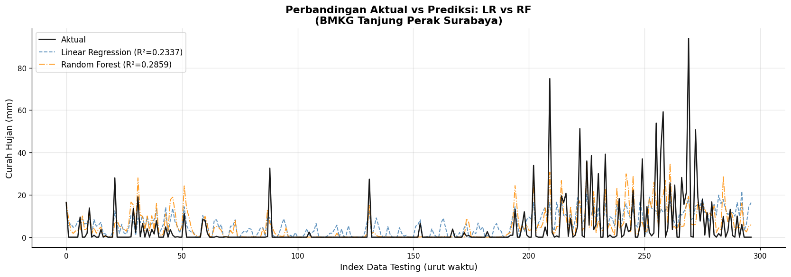
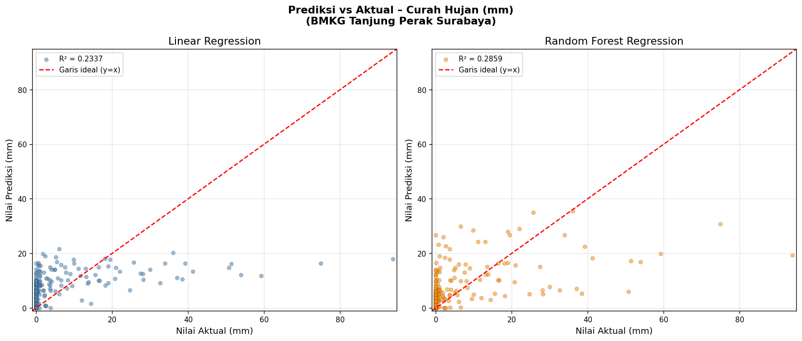

# Rainfall Prediction in Surabaya

## Overview

This project focuses on predicting **daily rainfall in Surabaya** using meteorological observation data from BMKG Maritim Tanjung Perak Surabaya.

Two regression models were implemented and compared:

* **Linear Regression**
* **Random Forest Regression**

The project aims to explore how meteorological variables can be used to predict rainfall and to compare the performance of a linear model with a tree-based ensemble model.

---

## Objectives

The main objectives of this project are:

1. To preprocess and analyze meteorological observation data.
2. To identify variables that can be used to predict rainfall.
3. To build a rainfall prediction model using Linear Regression.
4. To build a rainfall prediction model using Random Forest Regression.
5. To evaluate and compare model performance using RMSE and R².

---

## Dataset

The dataset consists of **hourly synoptic observations** collected from BMKG Maritim Tanjung Perak Surabaya covering the period from **January 2022 to January 2026**.

The hourly observations were processed into daily data before being used for modeling.

### Variables

| Variable | Description               |
| -------- | ------------------------- |
| `Tavg`   | Average temperature       |
| `RH_avg` | Average relative humidity |
| `ff_avg` | Average wind speed        |
| `P0`     | Atmospheric pressure      |
| `RR`     | Rainfall                  |

`RR` is used as the **target variable**, while the other meteorological variables are used as predictor features.

---

## Methodology

The general workflow of this project is:

```text
Raw BMKG Data
      ↓
Data Cleaning
      ↓
Hourly → Daily Aggregation
      ↓
Feature Selection
      ↓
Train-Test Split
      ↓
Model Training
      ↓
Prediction
      ↓
Model Evaluation
      ↓
Model Comparison
```

### 1. Data Preprocessing

The raw hourly observations were cleaned and aggregated into daily observations.

The resulting dataset was saved as:

```text
data_harian_bmkg_2022_2026.csv
```

### 2. Train-Test Split

The dataset was divided into:

* **80% training data**
* **20% testing data**

A fixed `random_state = 42` was used to ensure reproducibility.

### 3. Linear Regression

Linear Regression was used as a baseline model to estimate the relationship between meteorological variables and rainfall.

Before modeling, the predictor variables were standardized using **StandardScaler**.

### 4. Random Forest Regression

Random Forest Regression was used to capture potentially nonlinear relationships between the meteorological variables and rainfall.

The main parameters used were:

```text
n_estimators = 200
min_samples_split = 5
min_samples_leaf = 2
random_state = 42
n_jobs = -1
```

The predicted rainfall values were also constrained to be non-negative.

---

## Model Evaluation

The models were evaluated using:

### Root Mean Squared Error (RMSE)

RMSE measures the average magnitude of prediction errors. Lower RMSE indicates smaller prediction errors.

### R² Score

R² measures the proportion of variation in the target variable that is explained by the model.

Higher R² indicates that the model explains more of the variation in the observed rainfall data.

---

## Results

The model evaluation produced the following results:

| Model                    |    RMSE |     R² |
| ------------------------ | ------: | -----: |
| Linear Regression        | 16.6940 | 0.1366 |
| Random Forest Regression | 15.8447 | 0.2222 |

Based on these evaluation metrics, the Random Forest model produced a lower RMSE and a higher R² value on the test data.

### Actual vs Predicted



### Model Performance Comparison



---

## Interpretation

The results show that the Random Forest Regression model captured more of the variation in daily rainfall than the Linear Regression model based on the test-set metrics used in this project.

However, the R² values indicate that a substantial portion of rainfall variation remains unexplained. This suggests that additional factors and modeling approaches may be needed to improve rainfall prediction.

Rainfall is influenced by complex atmospheric processes, and the variables used in this project represent only a subset of the factors that may affect rainfall.

---

## Technologies

The project was developed using:

* Python
* Pandas
* NumPy
* Matplotlib
* Scikit-learn
* Jupyter Notebook

---

## Future Improvements

Several improvements could be explored in future work:

* Incorporating additional meteorological variables.
* Using time-series-based train-test splitting.
* Performing hyperparameter tuning.
* Comparing additional machine learning algorithms.
* Applying feature engineering based on temporal and meteorological patterns.
* Exploring time-series forecasting approaches.
* Evaluating the model using additional performance metrics.

---
